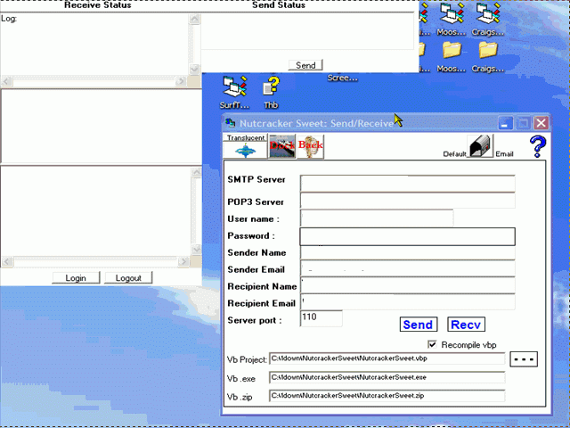



## NutCracker Sweet \- Autoresponder Crack proof registration ;\)

### Description

Updated ---(09-19-2007)--- This program is a combination of a few processes combined into one project. The idea was to develop an automated uncrackable (yeah right;) software registration process. I decided to use the serial number of the client's hard drive as the registration method, but I needed to embed this within the actual distributed executable. My solution (which is a work in progress), was to construct an autoresponder which would search for a subject keyword with the serial number. Write this to a module, re-compile the program with the module. Then, zip the executable using Winzip and finally email this back to the client. A help file is included. I've borrowed from a number of sources to get the autoresponder to work properly. You will need to compile the 2 DLL's included within the project. vbSendMail.dll Version 3.65 by Dean Dusenbery &amp; FreeVBCode.com and POP3 library, http://www.evict.nl/open_source.asp: txtCodeId=62794 are greatly appreciated. Keywords: email, pop3, smtp, send, receive 

----

Updated with the following changes: The pop3 DLL upload was incomplete and this is corrected. I've added a link to the help file: http://moosenose.com/NutcrackerSweet/NutcrackerSweet.htm

The interface has improved with the send and receive dialogs, the ability to dock, stay on top and go translucent. You can also launch your default email program and the help file shows how to included a Send/Receive to Outlook if it is present and referenced. I've also added the ability to send the client emails using a web portal thus avoiding smtp on the registrant end and this asp is included. Finally, I've added sampling the MAC address of the ethernet card to the registration process. The only way that I could do this on my computer was by parsing ipconfig.exe /all as the other methods didn't work...Oops, I fixed a little error that I missed.
 
### More Info
 

             |
---                |---
**Submitted On**   |2007-10-28 00:55:52
**By**             |[Warren Goff](https://github.com/Planet-Source-Code/PSCIndex/blob/master/ByAuthor/warren-goff.md)
**Level**          |Intermediate
**User Rating**    |4.8 (24 globes from 5 users)
**Compatibility**  |VB 6\.0
**Category**       |[Complete Applications](https://github.com/Planet-Source-Code/PSCIndex/blob/master/ByCategory/complete-applications__1-27.md)
**World**          |[Visual Basic](https://github.com/Planet-Source-Code/PSCIndex/blob/master/ByWorld/visual-basic.md)
**Archive File**   |[NutCracker2083939192007\.zip](https://github.com/Planet-Source-Code/warren-goff-nutcracker-sweet-autoresponder-crack-proof-registration__1-69340/archive/master.zip)

